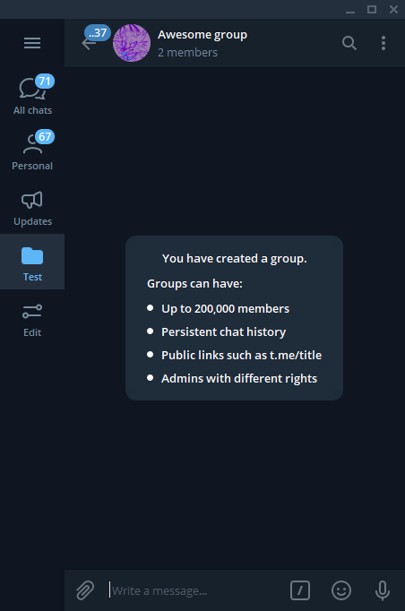

[@FoxBot](https://t.me/FoxBot) is a Telegram bot designed to make sharing
artwork easier. It has lots of features designed for [inline](#inline-mode),
[private](#private-mode), [group](#group-mode), and [channel](#channel-mode)
use. The primary goal is to make sure it's easier to give the artist the credit
they deserve than not.

For essentially all features, it supports FurAffinity, e621, Twitter, Weasyl,
Inkbunny, Mastodon (any instance), and direct links.

### Inline Mode

Inline mode was the original feature of FoxBot. It allows you to use it in any
group or channel without having it be a member.

When using this inline search, it provides a direct link to the image and a link
to the artist's page. If a direct link to an image on FA or e621 is posted, it
will convert the link back into the original submission. Images on unknown sites
are reverse image searched to determine the original source.

The bot can also convert WebM videos to formats supported by Telegram.

### Private Mode

If you're looking for the source of an image, all you have to do is forward or
paste the image to the bot. Within a few seconds, you'll get a reply with where
the image may have come from.

In the unfortunate case that the source can't be found, you have the option to
get a notification if it is found sometime in the future. Clicking the
'Notify Me' button will send you up to one message if the source is ever
located.

### Group Mode

This mode makes the bot exceptionally useful in groups. By default, adding it to
a group gives it no access to your messages.

To use it, reply to any photo posted in the group with the `/source` command.

There is also the `/mirror` command to get the images from posted links. This
works with any number of links in the message.

If the bot has delete permissions in the chat, it will delete the the `/source`
or `/mirror` command and reply directly to the message it is interacting with.

You can also enable automatically sourcing all images posted within a group.
This can only be enabled by a group administrator and the bot must also be given
administrative permissions, although all permissions can be disabled. Once
you're ready, just run the `/groupsource` command and you'll get a confirmation
it has been enabled.

It can automatically detect links in the original post and will ignore the post
if the source was already included.

### Channel Mode

Lastly, you can add the bot to your Telegram channel and it will update all of
the posts to include a source. Adding it to your channel will automatically
enable this feature.

It only needs permission to edit messages.

### More Details

It's possible to sign into your Twitter account to have all of these access
features from your locked account. Just use the `/twitter` command in a private
chat with the bot.

All of the reverse image search features are powered by
[FuzzySearch](https://fuzzysearch.net/), another one of my projects. It provides
an API to implement reverse searching in other projects.

### Command Reference

| Command          | Explaination |
| ---------------- | ------------ |
| `/source`        | Reverse image search the image in the message being replied to. |
| `/mirror`        | Look at all URLs in this message or the message being replied to, download the images, and post them. |
| `/alts`          | Try to find alternate versions of an image. This also finds other people who have posted the image. |
| `/twitter`       | Authenticate your Twitter account to get your content from a locked account. |
| `/settings`      | Some options for the bot, such as preferred ordering of sites in source results. |
| `/groupsource`   | Automatically try to find sources for every image posted in a group that doesn't already have a source. |
| `/grouppreviews` | Hide link previews for sources posted in the group. |

### Artwork Used

Of course, here's attribution for the artwork used in the above examples.

* Artwork used in all examples &mdash; [@Kosseart](https://twitter.com/Kosseart/status/1303692930557915136)
* FoxBot profile picture &mdash; [@BA5ILEUS](https://twitter.com/BA5ILEUS/status/480205213765091328)
* 'Awesome group' group picture &mdash; [@infurnalyote](https://twitter.com/infurnalyote)
* 'Awesome artwork' channel picture &mdash; [@Growlbeast](https://twitter.com/Growlbeast/status/1156681983197511682)
